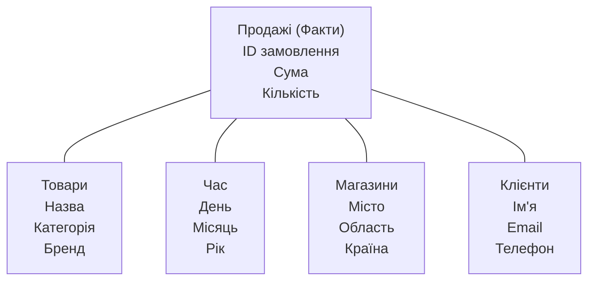
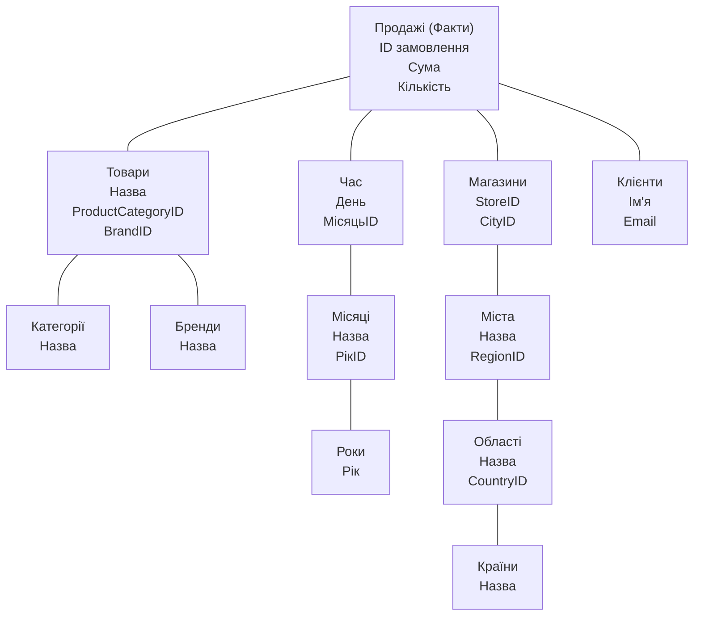

# 🗓️ Заняття 2 — ACID vs BASE та основи моделювання даних

## 🎯 Ціль заняття

Зрозуміти:

* **як поводяться дані в різних системах**
* **чому не всі бази працюють однаково**
* **як правильно проєктувати структуру даних**

  * для транзакцій
  * для аналітики

> ❗ Мінімум термінів — максимум розуміння
> ❗ Без складного SQL

---

## 🧠 Частина 1. ACID проти BASE — як бази поводяться з даними

### Навіщо це взагалі знати?

Бо **Data Engineer працює з різними типами баз**:

* транзакційними (OLTP)
* аналітичними
* розподіленими

І **очікування від даних у них різні**.

---

## 🔹 ACID — строгі правила для транзакцій

### Що таке ACID?

**ACID** — це набір гарантій, які дає база даних при роботі з транзакціями.

Розшифровка:

| Літера | Значення    | Простими словами                   |
| ------ | ----------- | ---------------------------------- |
| A      | Atomicity   | або все, або нічого                |
| C      | Consistency | дані завжди валідні                |
| I      | Isolation   | транзакції не заважають одна одній |
| D      | Durability  | якщо збереглось — не зникне        |

---

### Життєвий приклад (банк 💳)

Переказ 1000 грн:

1. зняти з рахунку А
2. додати на рахунок Б

❌ Якщо зняли, але не додали — **катастрофа**

👉 ACID гарантує:

* або обидві дії
* або жодної

---

### Де використовується ACID?

* банки
* платежі
* замовлення
* будь-які **критичні транзакції**

📌 Типові OLTP-бази:

* PostgreSQL
* MySQL
* SQL Server

---

## 🔹 BASE — гнучкість і масштаб

### Що таке BASE?

**BASE** — підхід, який жертвує строгістю заради:

* швидкості
* масштабування
* доступності

Розшифровка:

| Літера | Значення              | Пояснення                         |
| ------ | --------------------- | --------------------------------- |
| B      | Basically Available   | система майже завжди доступна     |
| A      | Soft state            | дані можуть тимчасово змінюватись |
| E      | Eventually consistent | з часом дані вирівняються         |

---

### Життєвий приклад (соцмережа 📱)

Ти поставив лайк:

* у тебе він зʼявився
* у друга — через 2 секунди

👉 Це **нормально для BASE**

📌 Головне:

> система працює, навіть якщо дані тимчасово не ідеальні

---

### Де використовується BASE?

* логування
* події
* аналітика
* великі розподілені системи

📌 Типові системи:

* NoSQL
* Data Lakes
* Event systems

---

## ⚖️ ACID vs BASE — порівняння

| ACID                     | BASE                |
| ------------------------ | ------------------- |
| Строгі гарантії          | Гнучкість           |
| Критичні дані            | Масові дані         |
| Повільніше масштабується | Легко масштабується |
| OLTP                     | OLAP / Big Data     |

---

## ❗ Важливий висновок

❌ Немає “краще”
✅ Є “під задачу”

👉 Data Engineer **обирає модель**, а не сліпо використовує одну.

---

# 🧱 Частина 2. Основи моделювання даних

## Що таке моделювання даних?

**Моделювання даних** — це:

> проєктування структури таблиць і звʼязків між ними

📌 Мета:

* щоб дані були логічні
* зрозумілі
* зручні для роботи

---

## 🔹 ERD (Entity Relationship Diagram)

### Що таке ERD?

**ERD** — це схема, яка показує:

* таблиці (entities)
* поля
* звʼязки між таблицями

---

### Життєвий приклад (магазин)

Сутності:

* User
* Order
* Product

Звʼязки:

* User → Order (1 до багатьох)
* Order → Product (багато до багатьох)

📌 ERD = **карта бази даних**

---

### Навіщо ERD Data Engineer?

* розуміти чужу БД
* пояснювати структуру команді
* проєктувати нові системи

---

## ⭐ Схема «Зірка» (Star Schema)

### Що це?

**Star schema** — модель для **аналітики**.

📌 Є:

* одна **fact table** (факти)
* кілька **dimension tables** (довідники)

---

### Приклад

**FactSales**

* дата
* сума
* кількість

**Dimensions**

* Date
* Product
* Customer
* Store

📌 Вигляд як зірка:

* факт у центрі
* довідники навколо

---

### Коли використовують?

* Data Warehouse
* BI
* аналітичні запити

👉 Просто і швидко читається

---

## ❄️ Схема «Сніжинка» (Snowflake Schema)

### Що це?

Розширення схеми «Зірка», де:

* довідники **нормалізовані**
* є вкладені таблиці

---

### Приклад

Product → Category → Subcategory

📌 Більше таблиць
📌 Менше дублювання

---

### Порівняння Star vs Snowflake

| Star          | Snowflake        |
| ------------- | ---------------- |
| Простіша      | Складніша        |
| Швидші запити | Менше дублювання |
| Менше join    | Більше join      |

---

## 🧠 Головна ідея для студентів

* **ERD** — для розуміння OLTP
* **Star / Snowflake** — для OLAP
* Data Engineer **перетворює одне в інше**

---

## 📝 Контрольні питання

1. Чому ACID важливий для банків?
2. Чому BASE підходить для аналітики?
3. У чому різниця між ERD і Star schema?
4. Коли краще Snowflake, а коли Star?

---

# 🌟 Зірка vs Сніжинка ❄️: Просто про моделювання даних

Перш ніж розбирати схеми, треба запам'ятати два головні елементи, з яких вони складаються:

1.  **Таблиця ФАКТІВ (Fact Table):** Це "що сталося". Тут живуть цифри (кількість продажів, сума грошей, температура). Вона завжди в центрі.
2.  **Таблиця ВИМІРІВ (Dimension Table):** Це "деталі". Тут живуть описи (ім'я клієнта, назва товару, адреса магазину).

---

## 1. Схема «Зірка» (Star Schema)
Це найпростіша модель. Уявіть сонце (факти) і промені (виміри).

### Як вона виглядає:
*   **У центрі:** одна велика таблиця з цифрами.
*   **Навколо:** таблиці-довідники, які **не розбиваються** на дрібні частини. Якщо в товарі є категорія, вона пишеться прямо в таблиці товарів.

### Проста схема «Зірки»:

**👍 Плюси:**
*   Дуже швидка (комп'ютеру легко збирати дані).
*   Дуже проста (аналітик не зламає голову).

**👎 Мінуси:**
*   Дані часто повторюються (наприклад, назва міста "Київ" буде написана тисячу разів у таблиці магазинів). Це займає більше місця.

---

## 2. Схема «Сніжинка» (Snowflake Schema)
Це "Зірка", яка пішла в спортзал і стала дуже педантичною. Тут ми прибираємо всі повтори.

### Як вона виглядає:
*   Виміри розбиваються на ще менші таблиці (нормалізуються).
*   Наприклад, ми не пишемо "Київ" у таблиці магазинів. Ми ставимо там ID міста, а саму назву "Київ" виносимо в окрему таблицю "Міста".

### Проста схема «Сніжинки»:

**👍 Плюси:**
*   Порядок в даних (жодних повторів).
*   Займає менше місця на диску.

**👎 Мінуси:**
*   Працює повільніше (треба "склеювати" багато таблиць, щоб отримати один звіт).
*   Важче підтримувати та будувати.

---

## ⚖️ Що обрати? (Шпаргалка)

| Ознака | Зірка ⭐ | Сніжинка ❄️ |
| :--- | :--- | :--- |
| **Для кого?** | Для аналітиків та BI (швидкість) | Для економії місця (порядок) |
| **Швидкість запитів** | Дуже висока 🚀 | Нижча (через багато JOIN) 🐢 |
| **Дублювання даних** | Багато повторів (де нормалізація) | Майже немає (все розбито) |
| **Складність** | Просто, як двері | Складно, як лабіринт |

---

## 💡 Порада для початківця:
В сучасній інженерії даних **частіше використовують «Зірку»**. Чому? Тому що диски зараз дешеві, а час аналітика та швидкість роботи бізнесу — дорогі. Краще нехай дані трохи дублюються, але звіти "літають".

---

### 🧠 Завдання для самоперевірки:
Уявіть, що ви моделюєте базу для **бібліотеки**.
1. Якщо ви створите таблицю `Книги`, де вкажете назву, автора та жанр в одному рядку — це **Зірка** чи **Сніжинка**?
2. Якщо ви винесете `Авторів` в окрему таблицю, а `Жанри` — в іншу, і з’єднаєте їх з книгами — це що?

*(Відповідь: 1 — Зірка, 2 — Сніжинка)*
