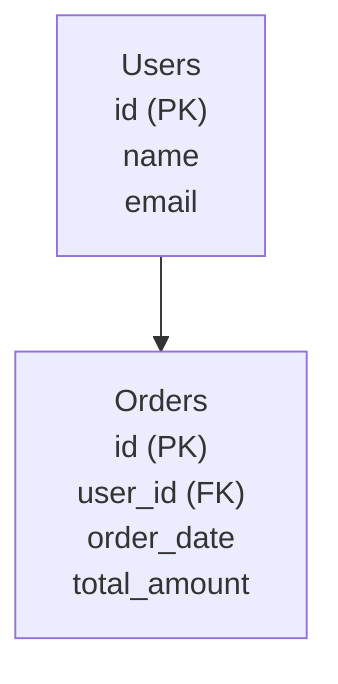
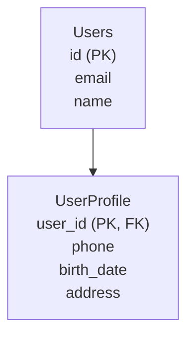
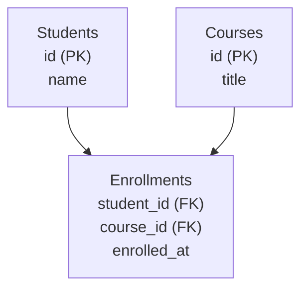

## 🔗 Найпростіший приклад звʼязку таблиць (1 → N)

Почнемо **з максимально простої схеми**,
щоб зрозуміти саму ідею звʼязків між таблицями.

### Ситуація з життя

* Є **користувач**
* Є його **замовлення**

👉 Один користувач може мати **багато замовлень**
👉 Але кожне замовлення належить **одному користувачу**

Це і є звʼязок **One-to-Many (1:N)**

---

### 📊 Візуальна схема (таблиці + стрілка)



---

### 🧠 Як це читати (ДУЖЕ ВАЖЛИВО)

* `Users` — **батьківська таблиця**
* `Orders` — **дочірня таблиця**
* стрілка означає:

  > один Users → багато Orders

📌 Поле `user_id (FK)` у таблиці `Orders`:

* зберігає `id` користувача
* і створює **звʼязок між таблицями**

---

### 💬 Пояснення словами (як має говорити студент)

> Таблиця `Orders` залежить від `Users`.
> Замовлення не може існувати без користувача,
> але користувач може існувати без замовлень.

---

## 🔁 Як це виглядає в draw.io

Те саме, але у графічному редакторі:

1. Малюємо прямокутник **Users**
2. Малюємо прямокутник **Orders**
3. Проводимо стрілку:

   * від `Users.id`
   * до `Orders.user_id`
4. Підписуємо:

   * **1 → N**

📌 Це **та сама логіка**, що і в Mermaid-схемі вище.

---

## 🔗 Тепер складніший приклад (із кількома таблицями)

Після простого прикладу студенти **готові** до повної ERD 👇

(і тут ти логічно переходиш до вже існуючого блоку)

> **Основні таблиці:**
>
> * Users
> * Orders
> * OrderItems
> * Products

І далі йде твій блок:

* Users → Orders
* Orders → OrderItems
* Products → OrderItems
* пояснення Many-to-Many

---

## 🧠 Методичний сенс (для тебе як викладача)

Цей простий Mermaid-блок:

* знімає страх
* дає **якір розуміння**
* після нього ERD у draw.io **стає очевидною**

📌 Без цього студенти часто:

* механічно малюють
* не розуміють, *чому саме так*

---

## 📝 Міні-питання після цього блоку (прямо на уроці)

1. Де знаходиться Foreign Key?
2. Чому стрілка йде від Users до Orders?
3. Чи може існувати Orders без Users?


---

## 🔗 One-to-One (1:1)

### 📌 Що це означає

* Один запис у таблиці **A**
* відповідає **рівно одному** запису в таблиці **B**

👉 Використовується **рідко**, але важливий для розуміння.

---

### 🧠 Життєвий приклад

* Користувач
* Профіль користувача

Кожен користувач:

* має **один профіль**
* і кожен профіль належить **одному користувачу**

---

### 📊 Схема таблиць



---

### 🧠 Як це читати

* `UserProfile.user_id`:

  * **одночасно PK і FK**
* не може бути:

  * двох профілів для одного користувача

📌 Це і гарантує **1:1**

---

### 💬 Пояснення словами (як на співбесіді)

> Таблиця UserProfile розширює Users,
> але не створює нову сутність.
> Вона зберігає додаткові атрибути.

---

### ⚠️ Важлива ремарка

У реальних системах часто:

* **1:1 логічно**
* але фізично зберігають **в одній таблиці**

---

## 🔗 Many-to-Many (M:N)

### 📌 Що це означає

* Один запис у таблиці **A**
* може відповідати **багатьом** у **B**
* і навпаки

👉 У реляційних БД **напряму не реалізується**

---

### 🧠 Життєвий приклад

* Студенти
* Курси

Один студент:

* навчається на багатьох курсах

Один курс:

* має багато студентів

---

### ❌ Як НЕ МОЖНА

```text
Students ↔ Courses   ❌
```

Такі звʼязки **завжди ламаються**

---

### ✅ Як ПРАВИЛЬНО (через проміжну таблицю)



---

### 🧠 Як це читати

* `Enrollments` — **junction table**
* вона:

  * розбиває M:N
  * на два 1:N

📌 Кожен рядок =
**один студент + один курс**

---

### 💬 Пояснення словами

> Many-to-Many завжди реалізується
> через проміжну таблицю,
> яка містить Foreign Keys з обох сторін.

---

## 🧩 Порівняльна таблиця (корисно для конспекту)

| Тип звʼязку | Приклад            | Як реалізується      |
| ----------- | ------------------ | -------------------- |
| 1:1         | User – Profile     | PK = FK              |
| 1:N         | User – Orders      | FK у N               |
| M:N         | Students – Courses | Через junction table |

---

## 🧠 Як студент має це запамʼятати

> 🔑 Якщо між двома сутностями **“багато з обох боків”**
> → **шукаємо третю таблицю**

---

## 📝 Міні-завдання (5 хв на уроці)

1. Визначити тип звʼязку:

   * Книга – Автор
   * Країна – Столиця
   * Замовлення – Товар
2. Пояснити **чому**

---

## 🔄 Логічний перехід далі

Після цього блоку **ідеально заходить**:

* ERD інтернет-магазину
* або перехід до **Star Schema**
* або ACID vs BASE (чому OLTP ≠ OLAP)

