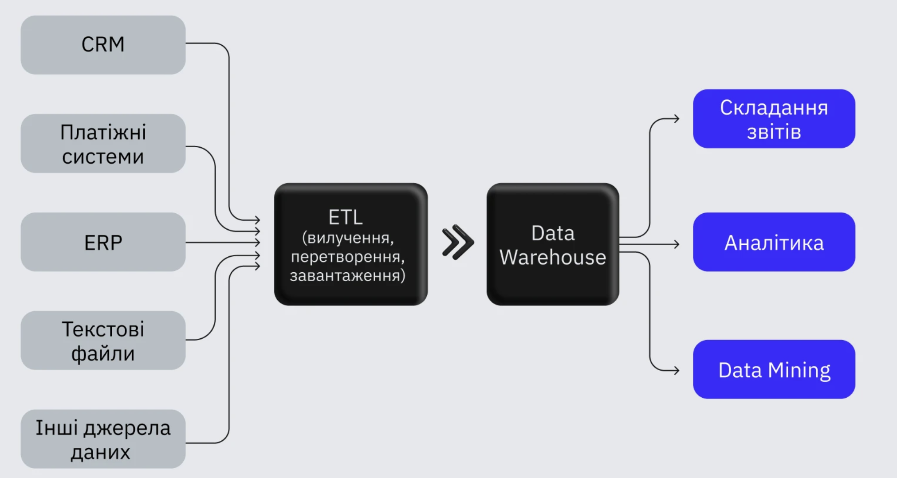
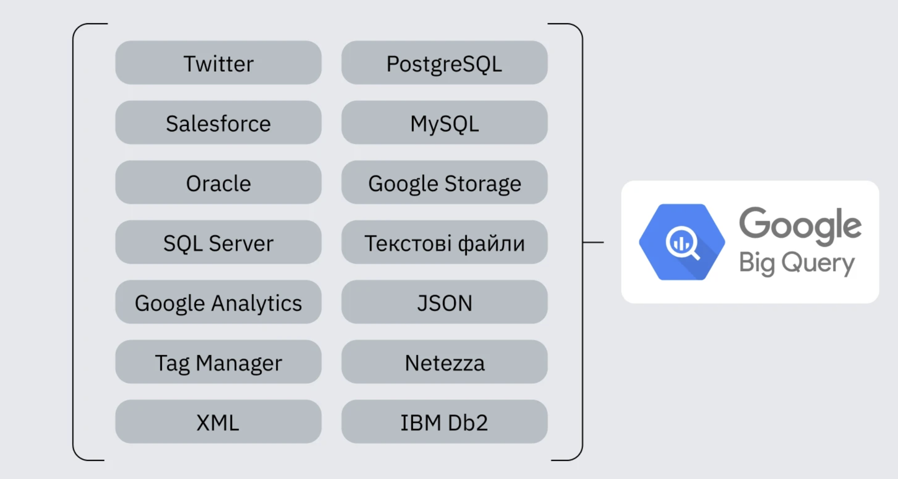

# Модуль 4: Сховища даних (Data Warehousing)

## 1. Сховища даних (Data Warehouse)

**Data Warehouse (DWH)** — централізоване сховище, що об'єднує дані з різних джерел в єдиній структурованій формі для аналітики та звітності.

### Характеристики DWH:

- **Предметно-орієнтований** — дані згруповані за бізнес-сутностями (продажі, клієнти, продукти)
- **Інтегрований** — дані з різних джерел приведені до єдиного формату
- **Незмінний (non-volatile)** — дані не змінюються після завантаження
- **Історичний (time-variant)** — зберігає історію змін

Компанії отримують дані з багатьох джерел. Рекламна інформація надходить з Google AdWords, сесії користувачів — з Google Analytics, дані продукту — з MySQL, MS Server або MongoDB. Інформація про платежі — з 1С. Крім цього, є тикет-системи, чати, CRM і навіть Excel-файли.

Ручна обробка та з’єднання цієї інформації — нераціонально і дорого. Тому багато компаній використовують сховище даних (Data Warehouse).



Сховища відрізняються від баз даних за низкою ознак:

- дані у сховищі необов’язково повинні надходити в реальному часі (якщо інше не передбачено бізнес-завданням);

- дані можуть мати різну структуру (залежно від джерел);

- сховище необов’язково повинне працювати швидко — головне, щоб швидкості вистачало для розв’язання всіх аналітичних завдань.

Сховище даних підходить для складних і комплексних обчислень краще, ніж база даних. Під час виконання складного запиту база даних може бути перевантажена. Через це ви ризикуєте втратити нову інформацію — для її обробки не вистачить ресурсів.

### Data Lake vs Data Warehouse vs Data Mart

| Критерій     | Data Lake       | Data Warehouse   | Data Mart         |
| ------------ | --------------- | ---------------- | ----------------- |
| Тип даних    | Неструктуровані | Структуровані    | Структуровані     |
| Схема        | schema-on-read  | schema-on-write  | schema-on-write   |
| Призначення  | Вся компанія    | Вся компанія     | Конкретний відділ |
| Якість даних | Низька (raw)    | Висока (очищені) | Висока            |
| Обсяг        | ТБ-ПБ           | ГБ-ТБ            | ГБ                |

### Як створити Data Warehouse

Для зберігання даних найчастіше використовують хмарні рішення. Їхні плюси:

- **Підтримка і масштабованість:** не треба виділяти кімнату для серверів і підключати нові у разі зростання навантаження. Зазвичай хмарне сховище масштабується автоматично.

- **Продуктивність:** хмарні рішення працюють швидше за традиційні й автоматично перерозподіляють навантаження.

- **Доступ до даних: щоб потрапити до хмарного сховища, не потрібно встановлювати сервер на комп’ютер.** Достатньо відкрити браузер і увійти до хмари. SQL-запит можна робити навіть зі смартфона.

Основні хмарні сховища — Amazon Redshift, Google BigQuery, Azure. У них різна вартість, продуктивність, екосистема, підтримка.

У продуктових IT-компаніях, де я працював, ми обирали Google BigQuery з таких причин:

- **Сховище в GBQ можна запустити швидко і без допомоги адміністраторів баз даних.** Потрібно тільки створити акаунт у Google Cloud.

- **Формат pay-as-you-go:** оплата в міру споживання лише за ті послуги, які використовуємо. Не треба заздалегідь обирати найоптимальніший пакет.

- **Готові pipeline-рішення.** Багато платформ надають послуги трансферу даних у GBQ. Тому сховище запускали лише аналітики без розробників та адміністраторів.



Основний мінус BigQuery — плата за запити. Кожен SQL-запит використовує певний обсяг пам’яті, за який потрібно платити наприкінці місяця. Тому раджу поставити обмеження на кількість запитів на день.

Створюючи сховище даних, варто брати до уваги всі складнощі. Основна проблема — конструювання пайплайнів. Треба налаштувати трансфер даних з усіх джерел в єдине сховище. Під час нього доведеться стикнутися з недосконалими API, обмеженнями з вивантаження або парсингом даних. Можна писати всі з’єднання самостійно або застосовувати готові рішення (наприклад, Owox, Alooma, Blendo). Тим, хто працює з великим обсягом інформації, краще написати свої скрипти, які синхронізуватимуть дані кожного дня. Малому бізнесу без адміністратора баз даних варто використовувати pipeline-платформу. Її вартість залежить від обсягу інформації та кількості з’єднань.

Друга складність — якість даних. Трансфер даних може не видавати помилку. Але водночас інформація може бути неповною (через обмеження в API). Також є ризик помилки під час подальшого парсингу змінних (наприклад, виникнуть проблеми з кодуванням даних з 1С).

Наступний крок після створення сховища — вибір інструментів для розробки frontend-частини. Бізнесу треба бачити графіки, зрізи, порівняння та динаміку.

Мій фаворит — Tableau. У ньому можна виконати будь-яке завдання. Головне — зрозуміти, що саме вам потрібно. Тут також можна обрати Tableau Online, і підтримкою/обслуговуванням серверів займатимуться фахівці Tableau. Недолік рішення — ціна. Ліцензії досить дорогі. Якщо ви поки що не готові витрачатися на BI-систему, але хочете візуалізувати дані з GBQ, альтернативою може стати Google Data Studio. Невеликій компанії на початку буде достатньо можливостей GDS.

---

## 2. Архітектура сховища даних

### Трирівнева архітектура (Medallion Architecture)

```
Bronze (Raw)  →  Silver (Cleaned)  →  Gold (Aggregated)
   |                    |                     |
 source data         очищені             вітрини,
   aka              нормалізовані       агрегати,
 staging            дані               звіти
```

- **Bronze Layer**: сирі дані як є (source-of-truth для відновлення)
- **Silver Layer**: очищені, збагачені, нормалізовані дані
- **Gold Layer**: агреговані, денормалізовані дані для BI

### ETL vs ELT

| Аспект     | ETL                 | ELT                             |
| ---------- | ------------------- | ------------------------------- |
| Порядок    | Transform → Load    | Load → Transform                |
| Потужність | Потрібен ETL-сервер | Трансформація в DWH             |
| Гнучкість  | Нижча               | Вища (данi вже в DWH)           |
| Коли       | Мало ресурсів DWH   | Cloud DWH (Snowflake, BigQuery) |

---

## 3. Підхід Kimball vs Inmon

### Ralph Kimball (Bottom-Up)

- **Старт**: з вітрин даних (Data Mart)
- **Модель**: вимірна (dimensional modeling) — Star Schema
- **Фокус**: на бізнес-процесах і відповідях на запити
- **Швидкість**: швидка віддача, ітеративне впровадження
- **Денормалізація**: так, свідома надлишковість

```sql
-- Star Schema (Kimball)
SELECT d.dept_name, SUM(f.sales_amount)
FROM FactSales f
JOIN DimDate d ON f.date_key = d.date_key
GROUP BY d.dept_name
```

### Bill Inmon (Top-Down)

- **Старт**: корпоративна нормалізована модель (EDW — Enterprise Data Warehouse)
- **Модель**: 3-тя нормальна форма (3NF)
- **Фокус**: на інтеграції даних всієї компанії
- **Швидкість**: повільний старт, довге впровадження
- **Масштаб**: єдине джерело правди для всієї організації

```sql
-- 3NF (Inmon)
SELECT d.dept_name, SUM(f.amount)
FROM FactFinance f
JOIN DimDepartment d ON f.dept_key = d.dept_key
...
```

### Порівняння

| Критерій       | Kimball                  | Inmon                          |
| -------------- | ------------------------ | ------------------------------ |
| Підхід         | Bottom-Up (знизу вгору)  | Top-Down (зверху вниз)         |
| Модель         | Вимірна (Star/Snowflake) | Нормалізована (3NF)            |
| Впровадження   | Ітеративне (швидко)      | "Великий вибух" (довго)        |
| Data Mart      | Первинний                | Похідний від EDW               |
| Денормалізація | Так                      | Ні (нормалізація)              |
| Зміни          | Легко додати новий Mart  | Важко змінити EDW              |
| Коли обирати   | Швидка аналітика, BI     | Складна інтеграція, compliance |

> **На практиці**: більшість DE використовують Kimball (або гібрид). Inmon — для великих Enterprise з regulatory вимогами.

---

## 4. Таблиці фактів і вимірів

### Fact Table (Таблиця фактів)

- Містить **числові показники** (measures): sales_amount, quantity, profit
- Має **зовнішні ключі** до таблиць вимірів
- **Granularity (grain)**: рівень деталізації одного рядка
- Типи: transactional, periodic snapshot, accumulating snapshot

```sql
CREATE TABLE FactSales (
    sales_key     INT PRIMARY KEY,
    date_key      INT REFERENCES DimDate(date_key),
    product_key   INT REFERENCES DimProduct(product_key),
    customer_key  INT REFERENCES DimCustomer(customer_key),
    quantity      INT,
    unit_price    DECIMAL(10,2),
    total_amount  DECIMAL(10,2)
);
```

### Dimension Table (Таблиця вимірів)

- Містить **описові атрибути**: назви, категорії, ієрархії
- **Surrogate Key (SK)**: технічний ключ (автоінкремент)
- **Degenerate Dimension**: вимір без таблиці (наприклад, номер замовлення)

```sql
CREATE TABLE DimProduct (
    product_key    INT PRIMARY KEY IDENTITY(1,1),  -- surrogate key
    product_id     INT,                            -- business key
    product_name   VARCHAR(100),
    category       VARCHAR(50),
    subcategory    VARCHAR(50),
    brand          VARCHAR(50)
);
```

### Star Schema vs Snowflake Schema

| Аспект         | Star Schema                  | Snowflake Schema                 |
| -------------- | ---------------------------- | -------------------------------- |
| DimProduct     | Всі атрибути в одній таблиці | Category, Brand — окремі таблиці |
| JOIN           | Менше (1 рівень)             | Більше (2-3 рівні)               |
| Продуктивність | Вища                         | Нижча                            |
| Надлишковість  | Так (денормалізація)         | Ні (нормалізація)                |
| Коли           | BI-інструменти               | Складні ієрархії                 |

---

## 5. Повільно змінювані виміри (SCD)

**Slowly Changing Dimensions (SCD)** — механізм відстеження змін у вимірах.

### SCD Type 0 (Retain original)

Значення не змінюються ніколи. Використовується для первинних ключів, дати створення.

```
customer_id | name     | signup_date
1           | Alice    | 2020-01-01   ← не змінюється ніколи
```

### SCD Type 1 (Overwrite)

Старе значення перезаписується новим. Історія втрачається.

```sql
UPDATE DimCustomer
SET city = 'Kyiv'
WHERE customer_id = 1;
```

| customer_id | name  | city |
| ----------- | ----- | ---- | ------------------------------------------ |
| 1           | Alice | Kyiv | ← Lviv було, стало Kyiv (історію втрачено) |

**Коли**: виправлення помилок, несуттєві атрибути.

### SCD Type 2 (Add new row) — НАЙПОПУЛЯРНІШИЙ

Додається **новий рядок** при зміні. Зберігається повна історія.

```sql
INSERT INTO DimCustomer (customer_id, name, city, effective_date, end_date, is_current)
VALUES (1, 'Alice', 'Kyiv', '2024-06-01', NULL, 1);

UPDATE DimCustomer
SET end_date = '2024-05-31', is_current = 0
WHERE customer_id = 1 AND is_current = 1;
```

| customer_key | customer_id | city | effective_date | end_date   | is_current |
| ------------ | ----------- | ---- | -------------- | ---------- | ---------- |
| 1            | 1           | Lviv | 2020-01-01     | 2024-05-31 | 0          |
| 2            | 1           | Kyiv | 2024-06-01     | NULL       | 1          |

**Коли**: треба історія змін (адреси, посади, ціни).

### SCD Type 3 (Add new attribute)

Додається **нова колонка** для попереднього значення.

```sql
ALTER TABLE DimCustomer ADD previous_city VARCHAR(100);
UPDATE DimCustomer SET previous_city = city, city = 'Kyiv' WHERE customer_id = 1;
```

| customer_id | city | previous_city |
| ----------- | ---- | ------------- |
| 1           | Kyiv | Lviv          |

**Коли**: треба тільки попереднє значення (обмежена історія).

### SCD Type 4 (Add history table)

Основний запис — Type 1 (overwrite), історія виноситься в окрему таблицю.

```sql
-- Основний запис (Type 1)
UPDATE DimCustomer SET city = 'Kyiv' WHERE customer_id = 1;

-- Історія (окрема таблиця)
INSERT INTO DimCustomer_History (customer_id, city, changed_at)
VALUES (1, 'Lviv', '2024-06-01');
```

**Коли**: основна таблиця має бути компактною, історія — для аудиту.

### SCD Type 5-6 (Mini-dimension + Hybrid)

- **Type 5**: комбінація Type 1 + Type 4 (текуче значення + міні-вимір)
- **Type 6**: комбінація Type 1 + 2 + 3 (поточне значення + історія в одній таблиці)

```sql
-- Type 6: одна таблиця, але з колонками поточного значення
SELECT
    customer_id,
    city AS current_city,          -- Type 1 (поточне)
    city_at_time_of_sale AS city,  -- Type 2 (на момент транзакції)
    previous_city                   -- Type 3 (попереднє)
FROM DimCustomer;
```

### Вибір типу SCD

| Тип | Історія        | Складність | Коли використовувати           |
| --- | -------------- | ---------- | ------------------------------ |
| 0   | Ні             | Низька     | Первинні ключі, дати створення |
| 1   | Ні             | Низька     | Виправлення помилок            |
| 2   | Повна          | Висока     | Адреси, назви, категорії       |
| 3   | Обмежена       | Середня    | "Попереднє значення"           |
| 4   | Окрема таблиця | Середня    | Аудит, великі таблиці          |
| 6   | Гібрид         | Висока     | Складні бізнес-вимоги          |

> **Порада DE**: 80% випадків використовуйте **SCD Type 2**. Це стандарт де-факто в Data Warehousing.

---

## 6. Ресурси

- [Kimball Group — DWH Toolkit](https://www.kimballgroup.com/data-warehouse-business-intelligence-resources/books/data-warehouse-dw-toolkit/)
- [Data Vault](https://www.datavault.com/)
- [Medallion Architecture (Databricks)](https://www.databricks.com/glossary/medallion-architecture)
- DOU: [Data Lake vs DWH vs Data Mart](https://dou.ua/forums/topic/46392/)
- DOU: [Як і коли створювати сховища даних](https://dou.ua/forums/topic/54249/)
